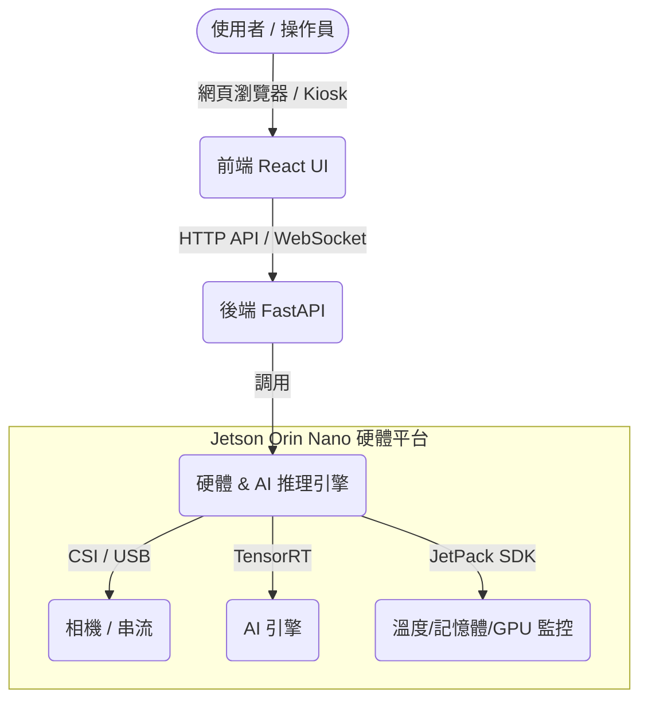

# Jetson Orin Nano UI/UX Kiosk 系統開發與部署指南

歡迎來到 NVIDIA 嵌入式系統介面（Dashboard）的開發世界！本專案旨在引導你從零開始，設計並部署一個基於 **FastAPI (後端)** + **React/Vite (前端)** 的 Vision AI 系統控制面板，並將其打包成開機自動運行的 **Chromium Kiosk 一體機**。

---

## 系統架構藍圖 (Architecture)

一個完整的 NVIDIA 嵌入式系統介面板，通常由以下三個核心層次組成：



---

## 專案目錄結構 (Project Structure)

建議的標準專案結構如下，這也是我們實機部署時的目錄配置：

```text
/opt/vision-system/
├── backend/                  # 後端程式碼 (Python FastAPI)
│   ├── app.py                # 主程式進入點
│   ├── inference/            # AI 推理相關邏輯
│   │   ├── detector.py       # 偵測器模組
│   │   ├── camera.py         # 相機讀取串流
│   │   └── postprocess.py    # 後處理邏輯
│   ├── models/               # AI 模型存放區 (.engine / .onnx)
│   │   ├── road_seg.engine
│   │   └── metadata.json
│   └── venv/                 # Python 虛擬環境
│
├── frontend/                 # 前端程式碼 (React + Vite + CSS)
│   ├── dist/                 # 編譯後的靜態網頁檔案 (生產環境用)
│   ├── src/                  # React 原始碼
│   └── package.json
│
├── config/                   # 系統設定檔
│   ├── system.yaml           # 系統參數設定
│   ├── camera.yaml           # 相機參數設定
│   └── users.json            # 使用者權限設定
│
├── logs/                     # 系統日誌
│   ├── backend.log
│   └── inference.log
│
└── scripts/                  # 自動化部署腳本
    ├── install.sh            # 一鍵安裝依賴
    ├── start.sh              # 啟動腳本
    └── stop.sh               # 停止腳本
```

---

## 學習路徑與核心單元

### 🎯 第一階段：環境準備與基礎觀念
- [x] 理解 前端 (UI)、後端 (API)、硬體 (AI/CUDA) 的分工。
- [x] 在 Jetson 上安裝 Python 虛擬環境與基礎依賴 (`FastAPI`, `Uvicorn`, `OpenCV`, `NumPy`)。
- [x] 在開發主機 (如 Windows) 上配置 Node.js 與前端 React 開發環境。

### ⚙️ 第二階段：後端 API 開發 (FastAPI)
- [ ] 撰寫最簡單的 `app.py`，建立第一個 API 接口。
- [ ] 透過 Python 讀取 Jetson 硬體狀態（CPU/GPU 溫度、內存使用率）。
- [ ] 使用 OpenCV 讀取 USB / CSI 相機影像並在 API 中進行即時傳輸。

### 🎨 第三階段：前端介面設計 (React)
- [ ] 採用現代化的暗色調 (Dark Mode) 與玻璃微光質感 (Glassmorphism)，展現科技感。
- [ ] 整合前端與後端 API，實現即時數據更新與相機畫面渲染。
- [ ] 建立控制按鈕，例如「開始偵測」、「停止偵測」、「模型切換」。

### 🚀 第四階段：實機部署與 Kiosk 整合
- [ ] 撰寫 systemd 服務設定檔，讓後端與前端在開機時自動於背景執行。
- [ ] 設定 GDM3 自動登入，跳過 Linux 桌面密碼輸入。
- [ ] 配置 Chromium Kiosk 模式，實現開機自動全螢幕顯示 UI。

---

> [!NOTE]
> 本文件作為你學習與開發的導覽手冊，詳細的教學步驟與程式碼範例已整理於你的對話紀錄中，你可以隨時參考並在 `/opt/vision-system/` 中進行實作。
